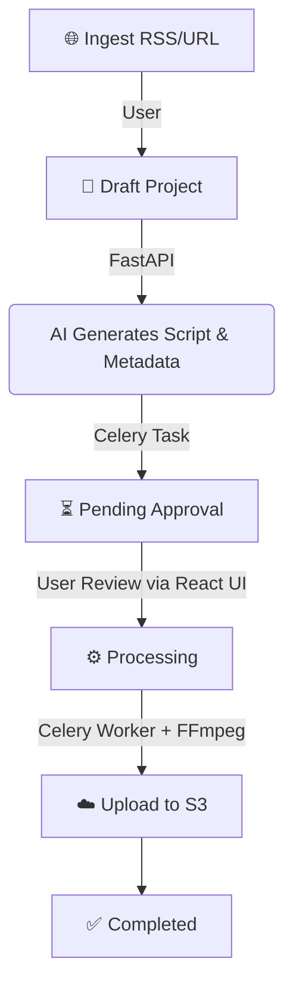

# The Kinetic Curator 🎬 - SaaS Short-Form Video Generator


> 🚀 **Project Status: SaaS Pivot Complete**
> Originally built as an autonomous Reddit-to-YouTube bot, this project has been fully transformed into a robust, multi-tenant SaaS application. It allows users to ingest content from any web article or RSS feed, review AI-generated scripts, and render viral short-form videos in the cloud.

---

## 💼 Technical Architecture (v2)

This project has been rebuilt from the ground up to support scale, human-in-the-loop approvals, and multi-tenant security.

| Category               | Technologies & Skills                                                                         |
| ---------------------- | --------------------------------------------------------------------------------------------- |
| **Frontend**           | React 18, Vite, TailwindCSS (Vivid Flux / Kinetic Curator design system), Axios, React Router |
| **Backend API**        | FastAPI, Pydantic (v2), JWT Authentication, Passlib (bcrypt)                                  |
| **Database**           | PostgreSQL (via SQLAlchemy & Alembic), Multi-tenant (User isolation)                          |
| **Asynchronous Tasks** | Celery, Redis (Message Broker)                                                                |
| **Cloud Storage**      | AWS S3 (via Boto3) for scalable video asset storage                                           |
| **AI/ML Pipeline**     | LLM (Gemini), Speech-to-Text (Whisper), Text-to-Speech (Coqui TTS)                            |
| **Video Processing**   | MoviePy, FFmpeg, Dynamic Subtitles, Background Segmenting                                     |
| **DevOps**             | Docker, Docker Compose (Multi-container: API, Celery Worker, Redis)                           |

---

## 🎯 How It Works

The system operates on an event-driven **State Machine Workflow**:



### ✨ Key SaaS Features

| Feature                       | Description                                                                    |
| ----------------------------- | ------------------------------------------------------------------------------ |
| 🛡️ **Multi-Tenant Auth**      | JWT login/register. Users securely manage only their own sources and videos.   |
| 🧠 **Multi-Source Ingestion** | Generic `ContentItem` model ingests direct URLs (BeautifulSoup) or RSS feeds.  |
| 👁️ **Human-in-the-loop**      | React Dashboard to review, edit, and approve AI scripts before heavy rendering.|
| ⚡ **Distributed Rendering**   | Video creation is offloaded to Celery workers backed by Redis.                 |

---

## 📁 Project Structure

```
Redishort/
├── app/                    # Backend (FastAPI + Celery + SQLAlchemy)
│   ├── api/                # REST endpoints (auth, sources, workflow)
│   ├── database/           # Models and DB connection
│   ├── models/             # Pydantic generic domain models
│   ├── celery_app.py       # Celery initialization
│   ├── content_ingester.py # URL/RSS Web Scraper
│   └── workflow.py         # Stateful video generation logic
├── frontend/               # Frontend (React + Vite)
│   ├── src/
│   │   ├── App.jsx         # Routing & Auth State
│   │   ├── Dashboard.jsx   # Projects & Sources View
│   │   ├── VideoReview.jsx # Script Editor & Approval UI
│   │   ├── Login.jsx       # Auth
│   │   └── Register.jsx    # Auth
├── assets/                 # Fonts, TTF, and Voice Samples
├── prompts/                # LLM AI instructions
├── text_processor.py       # AI Script Generation bridge
├── tts_generator.py        # Text-to-speech voice cloning
├── video_assembler.py      # MoviePy rendering logic
└── docker-compose.yml      # Multi-container local orchestration
```

---

## 🚀 Development Setup

### Prerequisites
- Docker & Docker Compose
- Node.js & npm (for local frontend development)

### 1️⃣ Configure Environment
```bash
cp .env.example .env
```
> Fill in your `SECRET_KEY`, `DATABASE_URL` (defaults to sqlite for dev), Redis URL, AWS S3 credentials, and Gemini API keys.

### 2️⃣ Launch Backend Infrastructure (API, Celery, Redis)
```bash
docker-compose up --build -d
```
> FastAPI will be available at `http://localhost:8000`

### 3️⃣ Launch Frontend (Local)
```bash
cd frontend
npm install
npm run dev &
```
> The React App will be available at `http://localhost:5173`. It automatically proxies `/api` calls to the backend.

---

<div align="center">

**Built by Izan Cano** • Upgraded to SaaS Architecture

</div>
